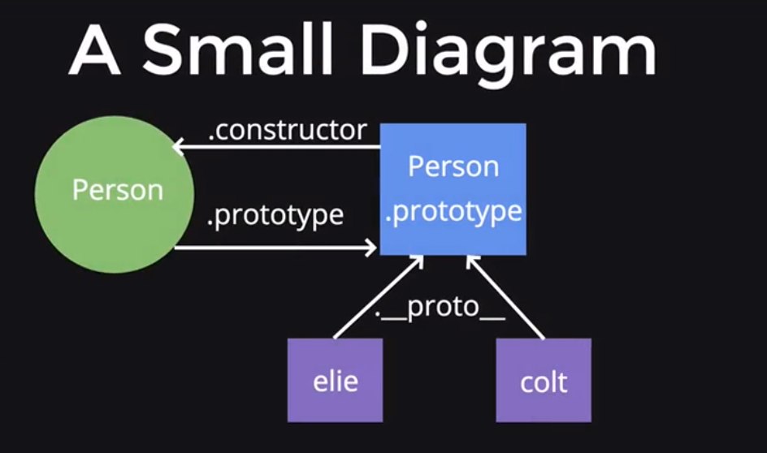
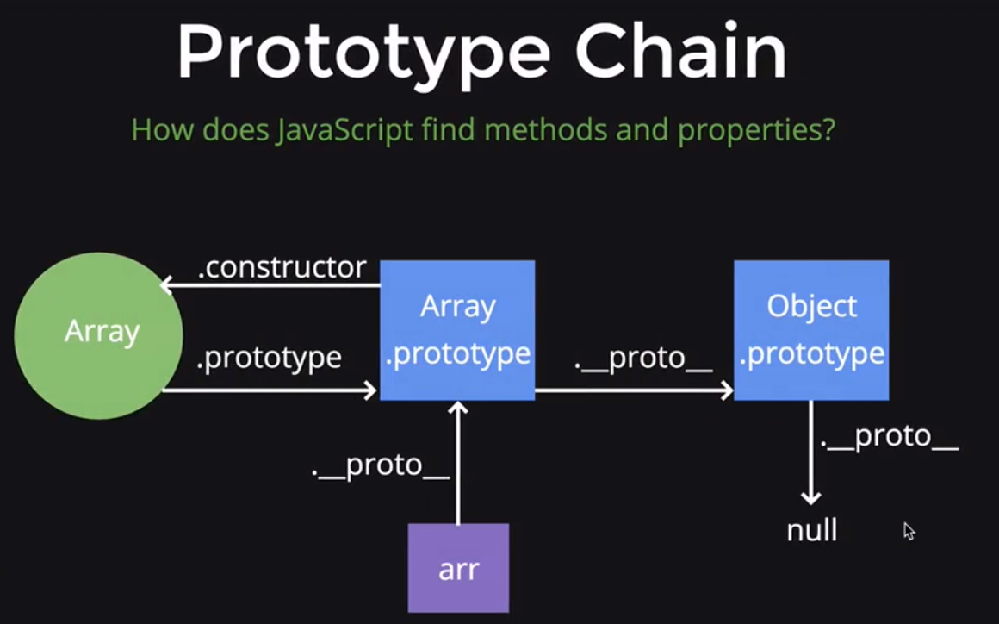

# Closures, 'this', and OOP

#### Table of Contents

- [Closures, 'this', and OOP](#closures-this-and-oop)
      - [Table of Contents](#table-of-contents)
  - [Closures](#closures)
    - [Private Variables](#private-variables)
  - [Keyword This](#keyword-this)
    - [Global context](#global-context)
      - [Global With Strict](#global-with-strict)
    - [Implicit (Object) Binding](#implicit-object-binding)
    - [Call Apply Bind (Explicit Binding)](#call-apply-bind-explicit-binding)
      - [Call](#call)
      - [Apply](#apply)
      - [Bind](#bind)
    - ['New' Keyword](#new-keyword)
  - [OOP in JS](#oop-in-js)
    - [Intro to OOP](#intro-to-oop)
      - [Constructor Functions](#constructor-functions)
    - [The 'New' Keyword](#the-new-keyword)
    - [Multiple Constructors](#multiple-constructors)
    - [Prototypes](#prototypes)
      - [Prototype Chain](#prototype-chain)
    - [Adding Methods to Prototype (Refactoring)](#adding-methods-to-prototype-refactoring)
    - [Prototypal Inheritance](#prototypal-inheritance)
      - [Object.create](#objectcreate)
      - [Why not 'new'?](#why-not-new)
      - [Resetting the Constructor](#resetting-the-constructor)

## Closures

A closure is a function that makes use of variables defined in outer functions that have previously returned
- A closure only exists when an inner function makes use of vars defined from an outer function that has returned
- If the inner function does not make use of any of the external vars, all we have is a nested function
- Closure does not exist if we do not return an inner function
- We can use them to create private variables and write better code that isolates our logic and application
  - Mostly replaced with 'let' and 'const'
    - not sure about this though

```javascript
function outer() {
  var data = 'closures are ';
  return function inner() {
    var innerData = 'awesome';
    return data + innerData;
  }
}

outer(); // returns the definition of the inner function

//function inner() {
//   var innerData = 'awesome';
//   return data + innerData;
// }

outer()(); // 'closures are awesome'

// we use a variables defined in outer function (data) inside of an inner function when the outer function has already returned (the function is returned, but we are still able to use this data variable)
```

Another example:

```javascript
function outer(a) {
  return function inner(b) {
    // the inner function is making use of the var 'a', which was defined in an outer function 'outer', and by the time this is calles, that outer function has returned
    // this function called 'inner' is a closure
    return a + b;
  }
}

outer(5)(5) // 10

var storeOuter = outer(5);
storeOuter(10) // 15
```

Notes:
- We have to 'return' the inner function for this to work
- We can either call the inner function right away by using an extra () or we can store the result of a function in a var (very similar to how 'bind' works)
- We do NOT have to give the inner function a name - we can make it anonymous
- Inner functions do not remember everything from outer functions that have returned - only the variables they need
  - When a function returns, it first checks if there are any inner functions which use variables defined in the function, and 'remembers' them if it needs to

### Private Variables

The most common use case for closures is to create a private variable

Private variable is a variable that can only be accessed in a certain scope, and not modified from an external scope

In other languages, there exists support for variables that can not be modified externally, but in JS we don't have that built in - we use closures for that

```javascript
function counter() {
  var count = 0;
  return function () {
    return ++count;
  }
}

counter1 = counter();
counter1(); // 1
counter1(); // 2

counter2 = counter();
counter2(); // 1
counter2(); // 2

counter1(); // 3 (not affected by counter2)

count // ReferenceError: count is not defined - because it's private!
```

Another example:

```javascript
// When we use a function that returns an object, that used closure is the foundation for a popular design pattern known as the module pattern

function classRoom() {
  var instructors = ['Colt', 'Elie'];
  return {
    getInstructors: function () {
      return instructors;
    },
    addInstructor: function (instructor) {
      instructors.push(instructor);
      return instructors;
    }
  }
}

course1 = classRoom();
course1.getInstructors(); // ['Colt', 'Elie']
course1.addInstructors('Ian'); // ['Colt', 'Elie', 'Ian']
course1.getInstructors(); // ['Colt', 'Elie']

course2 = classRoom();
course2.getInstructors(); // ['Colt', 'Elie'] - not affected by course1

// we also have NO access to instructors variable which makes it private - no one can modify it
// although there is a way to directly manipulate the instructors variable
// if we were to directly remove a value from the output of getInstructors, we could actually modify the instructors array

course1.getInstructors().pop();
// 'Ian'
course1.getInstructors();
// ['Colt', 'Elie']

// we can prevent this with concept in functional programming called immutability, which means that you cannot change the value of something
// to create that idea, we'll return a copy of the instructors array, and not the actual array that someone could accidentaly or intentionally manipulate
// in order to do that we will invoke the .slice() on our output so that we return a copy of the instructors array which will stop someone from externally modifying it; now this variable is completely private
function classRoom() {
  var instructors = ['Colt', 'Elie'];
  return {
    getInstructors: function () {
      return instructors.slice();
    },
    addInstructor: function (instructor) {
      instructors.push(instructor);
      return instructors.slice();
    }
  }
}

course1 = classRoom();
course1.getInstructors().pop(); // ['Colt']
course1.getInstructors().pop(); // ['Colt']
course1.getInstructors(); // ['Colt', 'Elie']
```

## Keyword This

What is 'this'?

- A reserved keyword in JS (we can't set it as a var)
- Value is determing by how a function is called (what we call 'execution context'), i.e. its value is determined at execution
  - Functions always are given 'argument' and 'this' keywords
- Can be determined using four rules (global, object/implicit, explicit, new)
  - They are not a part of official specification, just a helpful way to keep track of 'this' value

### Global context

This rule applies when 'this' is not inside of a declared object ('this' is in the wild'); it refers to the global object which in the browser is the 'window' object

Every var that we declare in the global scope is attached to the window object (`` var person = "Elie"; window.person // "Elie" ``)

```javascript
console.log(this) // window
var dog = 'Rusty'; // global variable, the best practice when using global vars is to declare them in the top part (even if they're empty) and then assign a value when needed
// window.dog === dog

function whatIsThis() {
  return this
}

whatIsThis() //window

function variablesInThis() {
  // when we put 'this' inside of a function, its value is still the global object (it's not in a declared object)
  // since the value of this is the window, all we are doing here is creating a global variable
  // this is a very bad practice
  this.person = 'Elie';
  
  var colt = 'Colt'; // this will be unavailable in the global scope, although it will be if we omit the 'var' keyword
}

colt // undefined
dog // Rusty

console.log(person) // Elie

```

What is declared object:

```javascript
var data = {}; // declaring an object

data.instructor = 'Elie'; // adding a key 'instructor' to data with value 'Elie' (it's inside of the declared object)
```

#### Global With Strict

When we enable strict mode and we are not inside a declared object

```javascript
"use strict"

console.log(this); // window

function whatIsThis() {
  return this;
}

whatIsThis()// undefined

function variablesInThis() {
  // since we are in strict mode this is undefined
  // so if we add a property on undefined and see what happens
  this.person = 'Elie';
}

variablesInThis(); // TypeError, can't set person on undefined!
```

### Implicit (Object) Binding

When the keyword 'this' is inside of a declared object, value of 'this' will always be the closest parent object

```javascript
// strict mode doesn't make a difference here

var person = {
  firstName: 'Elie',
  sayHi: function () {
    return 'Hi ' + this.firstName // this refers to the 'person' object
  },
  determineContext: this, // window
  // A keyword 'this' is defined when a function is run! There is not a function being run here to create a new value of 'this', so the value of 'this' is still the window
  determineContextFunction: function () {
    return this === person;
  }
}

person.sayHi() // 'Hi Elie'
person.determineContextFunction() // true
```

Nested objects:

```javascript
var person = {
  firstName: 'Colt',
  sayHi: function () {
    return 'Hi ' + this.firstName;
  },
  determineContext: function () {
    return this === person;
  },
  dog: {
    sayHello: function () {
      return 'Hello ' + this.firstName;
    },
    determineContext: function () {
      return this === person;
    }
  }
}

person.sayHi() // 'Hi Colt'
person.determineContext() // true

person.dog.sayHello() // 'Hello undefined'
person.dog.determineContext() // false
```

### Call Apply Bind (Explicit Binding)

Choose what we want the context of 'this' to be using call, apply or bind, to explicitly set the value of 'this'

These methods can only be used on functions

- Call
  - Parameters: thisArg, a, b, c, d, ... (thisArg - value of 'this' we want to be, other - any params we want to pass to the function in which we're changing value of 'this')
  - Invoke the function it is called on immediately
- Apply
  - Parameters: thisArg, [a, b, c, d, ...] (takes two parameters at most, thisArg is the same, the second - array of params we want to pass to the function)
  - Invoke the function it is called on immediately
- Bind
  - The parameters work like call, but bind returns a function with the context of 'this' bound already
  - Parameters: thisArg, a, b, c, d, ...
  - Doesn't invoke function immediately, it returns a function definition
    - If we do not invoke the function, but examine the variable we created, we are returned a 'function definition'
    - ``var first = function () { return 'Hello' }``
    - or ``function firstFunction() { return 'Hello' }``
    - ``first`` - prints out the definition above
    - ``first()`` - 'Hello'
  - Extremely powerful: we can save functions with the different value of 'this' and invoke them at a later point in time
  - Often used in async code, e.g. in setTimeout
  - Building block for advanced functional programming techniques like currying
    - Currying is the process of taking a function with multiple arguments and returning a series of functions that take one argument and eventually resolve to a value. The original function volume takes three arguments, but once curried we can instead pass in each argument to three nested functions
    - In other words: currying is the process of breaking down a function into a series of functions that each take a single argument
    - The idea is as follows: If you don’t provide all parameters for a function, it returns a function whose input are the remaining parameters and whose output is the result of the original function

#### Call

Fixing up with 'call':

```javascript
var person = {
  firstName: 'Colt',
  sayHi: function () {
    return 'Hi ' + this.firstName;
  },
  determineContext: function () {
    return this === person;
  },
  dog: {
    sayHello: function () {
      return 'Hello ' + this.firstName;
    },
    determineContext: function () {
      return this === person;
    }
  }
}

person.sayHi() // 'Hi Colt'
person.determineContext() // true

person.dog.sayHello.call(person) // 'Hello Colt'
person.dog.determineContext.call(person) // true
// notice that we do NOT invoke sayHello or determineContext, we just attach call onto it
// so there are no parentheses after say hello and determine context
```

Using 'Call' in the Wild (a common use case, to avoid duplication):

```javascript
var colt = {
  firstName: 'Colt',
  sayHi: function () {
    return 'Hi ' + this.firstName
  }
}

var elie = {
  firstName: 'Elie',
  // look at this duplication
  sayHi: function () {
    return 'Hi ' + this.firstName
  }
}

colt.sayHi() // Hi Colt
elie.sayHi() // Hi Elie

// refactor duplication with 'call', 'borrowing' the sayHi function from colt, setting value of 'this' to be elie
var colt = {
  firstName: 'Colt',
  sayHi: function () {
    return 'Hi ' + this.firstName
  }
}

var elie = {
  firstName: 'Elie',
}

colt.sayHi() // Hi Colt
colt.sayHi.call(elie) // Hi Elie

// we can even refactor the code more (by making a standalone function)
function sayHi() {
  return 'Hi ' + this.firstName
}

var colt = {
  firstName: 'Colt'
}
var elie = {
  firstName: 'Elie'
}

sayHi.call(colt) // Hi Colt
sayHi.call(elie) // Hi Elie
```

Another use for 'call':

```javascript
// let's imagine we want to select all the 'divs' on a page
var divs = document.getElementsByTagName('div');

// How can we find all the divs that have the text 'Hello'? Using a filter would be nice
divs.filter // undefined

// Unfortunately, divs is not an array, it's an array-like object, so filter won't work
// We need to convert an array-like object into an array just as we make copies of arrays - using slice (but with a slight modification)

// Instead of the target of slice (keyword this) being that array, let's set the target of 'this' to be our divs array-like object
var divsArray = [].slice.call(divs);
// the same thing as Array.prototype.slice.call(divs);
// we are trying to slice something that is not an array
// note that slice will not work on all data types, but it works for array-like objects

divsArray.filter(function(val) {
  return val.innerText === 'Hello';
});
```

#### Apply

Fixing up with 'Apply' (almost identical to call - except the parameters):

```javascript
var colt = {
  firstName: 'Colt',
  sayHi: function () {
    return 'Hi ' + this.firstName
  },
  addNumbers: function (a, b, c, d) {
    return this.firstName + ' just calculated ' + (a + b + c + d);
  }
}

var elie = {
  firstName: 'Elie',
}

colt.sayHi() // Hi Colt
colt.sayHi.apply(elie) // Hi Elie

// this is the same, but if we start adding arguments:
colt.addNumbers(1, 2, 3, 4) // Colt just calculated 10
colt.addNumbers.call(elie, 1, 2, 3, 4) // Elie just calculated 10
colt.addNumbers.apply(elie, [1, 2, 3, 4]) // Elie just calculated 10; arguments in array
```

When a function does not accept an array, apply will spread out values in an array for us

```javascript
var nums = [5, 7, 1, 4, 2];

Math.max(nums); // NaN
// it does not accept an array, it accepts a list of comma-separated values

Math.max.apply(this, nums); // 7
// if we use apply, we can pass an array of values and they will be spread out
// here we don't care about explicitly setting the value of the keyword this (it just refers to the global object), we just care about spreading an array of values out
```

Another example:

```javascript
function sumValues(a, b, c) {
  return a + b + c;
}

var values = [4, 1, 2];

sumValues(values); // '4, 1, 2undefinedundefined'
sumValues.apply(this, [4, 1, 2]); // 7
```

#### Bind

Example with 'Bind' (e.g. we don't know the total number of parameters):

```javascript
var colt = {
  firstName: 'Colt',
  sayHi: function () {
    return 'Hi ' + this.firstName
  },
  addNumbers: function (a, b, c, d) {
    return this.firstName + ' just calculated ' + (a+b+c+d);
  }
}

var elie = {
  firstName: 'Elie',
}

var elieCalc = colt.addNumbers.bind(elie, 1, 2, 3, 4) // function () {}...
elieCalc() // Elie just calculated 10

// with bind - we do not need to know all the arguments up front (when we bind it), we only need to know what we want the value of 'this' to be
// this is called partial application
var elieCalc2 = colt.addNumbers.bind(elie, 1, 2) // function () {}...
elieCalc(3, 4) // Elie just calculated 10 (1 and 2 from bind, 3 and 4 from invoking function)
```

'Bind' in the Wild (very commonly we use 'bind' to set the context of 'this' for a function that will be called at a later point in time, e.g. in async code when we sometimes 'lose' the context of 'this')


```javascript
// setTimeout is a method on the window object that's used to execute a function once after a specified time (takes up function and time)
var colt = {
  firstName: 'Colt',
  sayHi: function () {
    setTimeout(function () {
      console.log('hi ' + this.firstName)
    }, 1000);
  }
}

colt.sayHi() // Hi undefined (1000 ms later)

// since setTimeout is called at the later point in time, 'this' does NOT refer to the parent object, but refers to the global object (setTimeout attached to is a global 'window')
// even though it is defined inside of the 'colt' object when it's declared, the context in which function is executed is actually the global context
// we should explicitly set what we want 'this' to refer to, and we need to use 'bind' since 'call' and 'apply' immediately invoke a function

// correcting context of 'this' with 'bind':
var colt = {
  firstName: 'Colt',
  sayHi: function () {
    setTimeout(function () {
      console.log('hi ' + this.firstName)
    }.bind(this), 1000);
    // passing in 'this' as the first parameter to 'bind' since it refers to the 'colt' object
    // we are basically binding the 'correct' value of 'this' to be what we want when the function inside of setTimeout is called
    // instead of 'this' we can pass in the 'colt' variable to the 'bind' method, it's the same, but 'this' is more common and it's not 'hardcoding'
  }
}
```

### 'New' Keyword

We can set the context of 'this' using the 'new' keyword - it does more as well (see OOP section)

When we use 'new', a new object is created out of thin air

Keyword 'new' is used with the function, and inside of the function definition 'this' refers to the new object that is created

When 'new' is used, an implicit return 'this' is added to the function which uses it (see OOP section for details)

```javascript
function Person(firstName, lastName) {
  this.firstName = firstName
  this.lastName = lastName
}

var elie = new Person('Elie', 'Schoppik');
elie.firstName // 'Elie'
elie.lastName // 'Schoppik'
```

---

## OOP in JS

### Intro to OOP

OOP is a programming model based around the idea of objects and blueprints which create objects

- Blueprints are called 'classes'
- Objects created from classes are called 'instances'

In OOP we should try to make classes abstract and modular so that we can reuse classes easlily and share them amongst all parts of an app

JS does not have built-in support of clases unlike many other languages, e.g. python, java, but we can mimic the behavior of classes by using what JS has: functions, objects, and 'this' keyword

#### Constructor Functions

Imagine we want to make a few house objects, they will all have bedrooms, bathrooms, and numSqft (square feet)

Instead of making an infinite number of different objects, we can create a function to construct these similar 'house' objects; these functions are called 'Constructor Functions'

```javascript
function House(bedrooms, bathrooms, numSqft) {
  this.bedrooms = bedrooms;
  this.bathrooms = bathrooms;
  this.numSqft = numSqft;
}

// name should be capitalized (convention for constructor functions)
// 'this' is used
// we are attaching properties onto the keyword 'this'; we would like 'this' to refer to the object we will create from our construction function

var firstHouse = House(2, 2, 1000)
firstHouse() // undefined

// we are not returning anything from the function so our House function returns undefined
// we are not explicitly binding 'this' or placing it inside a declared object; this means the value of 'this' will be the global object, which is not what we want
// we should use 'new' keyword

var firstHouse = new House(2, 2, 1000);
firstHouse.bedrooms // 2
firstHouse.bathrooms // 2
firstHouse.numSqft // 1000
```

### The 'New' Keyword

The 'New' keyword must be used with constructor functions

- 'New' creates an empty object
- Then sets 'this' (in the constructor function) to be that empty object that was just created
- Adds the line 'return this' to the end of the function which follows it so that object that we've created using 'new' could be returned from the function
- Adds a property onto the empty object called '\_\_proto__' (we can access it), which links the 'prototype' property on the constructor function to the empty object we've just created
  - Double underscore is commonly called 'dunder'
  - This property is also known as 'dunder proto'

### Multiple Constructors

Let's create two constructor functions, one for a Car, and one for a Motorcycle:

```javascript
function Car(make, model, year) {
  this.make = make;
  this.model = model;
  this.year = year;
  // we can also set properties on the keyword 'this' that are preset values
  this.numWheels = 4;
}

function Motorcycle(make, model, year) {
  this.make = make;
  this.model = model;
  this.year = year;
  this.numWheels = 2;
}
```

And then refactor it, 'borrowing' the Car function and invoking it inside the Motorcycle function (we can't just call Car inside of a motorcycle since 'this' would refer to the object that we created from the Car function, i.e. we need to change value of 'this' to be the object created from the Motorcycle function)

```javascript
function Car(make, model, year) {
  this.make = make;
  this.model = model;
  this.year = year;
  this.numWheels = 4;
}

// call:
function Motorcycle(make, model, year) {
  Car.call(this, make, model, year);
  // we are changing 'this' (of Car) to be 'this' which refers to the new Motorcycle
  this.numWheels = 2;
}

// apply:
function Motorcycle(make, model, year) {
  Car.apply(this, [make, model, year]);
  this.numWheels = 2;
}

// even better using apply with 'arguments'
function Motorcycle(make, model, year) {
  Car.apply(this, arguments);
  // arguments is the list of all the arguments that are passed to a function, it's not technically an array but similar to it (array-like object)
  this.numWheels = 2;
}
```

### Prototypes



- Circle is a function, square is an object
- Every constructor function has a property on it called 'prototype', which is an object (it can also have methods and properties attached to it)
- The prototype object has a property on it called 'constructor', which points back to the constructor function
- Anytime an object is created using the 'new' keyword, a property called '\_\_proto__' gets created, linking the object and the prototype property of the constructor function
  - If properties or methods are placed on the 'person.prototype', they can be accessible from any object created from that constructor function
  - The way in which these objects (which are created by the constructor function) get accessed to the 'prototype' object is through the 'dunder proto' link

```javascript
// constructor function
function Person(name) {
  this.name - name;
}

// object created from the Person constructor
var elie = new Person('Elie');
var colt = new Person('Colt');

// .__proto__ points to the prototype property on the Person constructor
elie.__proto__ === Person.prototype; // true

// .constructor points back to the function
// it is not something we're using or manipulating frequently, but it is part in a concept of 'inheritance'
Person.prototype.constructor === Person; // true

// add a property isInstructor to prototype and set the value to be 'true'
Person.prototype.isInstructor = true;

// all of our objects which were created with 'new' have access to it
// since these objects have a link to Person.prototype, they can access anything inside of it
// this is the exact way that JS finds methods and properties on objects, and this is a prototype chain
elie.isInstructor; // true
colt.isInstructor; // true
```

#### Prototype Chain

The way that JS finds methods and properties is by looking at the object, and if it can't find the method or property you're looking for, it goes to that object's \_\_proto__

This keeps happening until the property or method is found; if it is not found, the expression evaluates to 'undefined'

Example for arrays:

```javascript
var arr = [];
// it is a shorthand for:
new Array
// we're using the built-in constructor in JS called 'Array' and making a new object from it
// we also know that we have some methods like .push, but where is it defined and how does JS know where to find it?
arr.push(10);
// it is defined in __proto__

console.dir(arr);
// Array[1]
//  0: 10
//  length: 1
//  >__proto__: Array[0]
//    >concat: function concat()
//    ...
//    >forEach: function forEach()
//    ...
//    >push: function push()
//    ...

arr.__proto__ === Array.prototype; // true
```

We can see this even further with another example:

In JS every object has a method called 'hasOwnProperty' which returns 'true' if an object has a property specified as a parameter of the 'hasOwnProperty' method

```javascript
arr.hasOwnProperty('length'); // true

console.dir(arr); // dir(arr)
// Array[1]
//  0: 10
//  length: 1
//  >__proto__: Array[0]
//    >concat: function concat()
//    ...
//    ...
//    >__proto__: Object // the next __proto__ is the Object.prototype
//      ...
//      >length
```



### Adding Methods to Prototype (Refactoring)

```javascript
function Person(name) {
  this.name = name;
  this.sayHi = function() {
    return 'Hi ' + this.name;
  }
}

elie = new Person('Elie');
elie.sayHi(); // Hi Elie

// this code works, but it is inefficient since every time we make an object using 'new' we have to redefine this function, but it is the same for everyone

function Person(name) {
  this.name = name;
}

// we put sayHi on the prototype
Person.prototype.sayHi = function() {
  return 'Hi ' + this.name; // refers to the object which is created
}

elie = new Person('Elie');
elie.sayHi(); // Hi Elie
```

Example:

```javascript
function Vehicle(make, model, year) {
  this.make = make;
  this.model = model;
  this.year = year;
  this.isRunning = false;
}

// We don't want to place properties on the prototype because each object created from the vehicle constructor should have its own isRunning property 

// however all of the functions like turn on turn off and hunk should be placed on the prototype, since we don't want to redefine them for every object we create

Vehicle.prototype.turnOn = function() {
  this.isRunning = true;
} // not sure if we need ; here

Vehicle.prototype.turnOff = function() {
  this.isRunning = false;
}

Vehicle.prototype.honk = function() {
  if (this.isRunning) {
    return 'Beep!';
  }
}
```

### Prototypal Inheritance

Inheritance is the passing of methods and properties from one class to another

In JS we don't actually pass one constructor to another, we pass the prototype property of one constructor to another constructor

The idea here is that since the prototype property is where all of our properties and methods live we need to have another constructor function get all those properties

There are two parts of inheritance
- Set the prototype property to be a new object created with another prototype (using Object.create)
- Reset the constructor property

```javascript
function Person(firstName, lastName) {
  this.firstName = firstName;
  this.lastName = lastName;
}

Person.prototype.sayHi = function() {
  return 'Hello ' + this.firstName + ' ' + this.lastName;
}

function Student(firstName, lastName) {
  return Person.apply(this, arguments);
}

Student.prototype.sayHi = function() {
  return 'Hello ' + this.firstName + ' ' + this.lastName;
}

// The first idea that might come to mind is let's assign the prototype property of one object to be another's so we can assign student.prototype to be person.prototype
// Now we can create an object from the student constructor and invoke the sayHi method and it works well
Student.prototype = Person.prototype;

var elie = new Student('Elie', 'Schoppik');
elie.sayHi(); // 'Hello Elie Schoppik'

// Not exactly

// Let's add something onto the student that prototype object
Student.prototype.status = function() {
  return 'I am currently a student!';
}

// We want a student to inherit from person; so if we did this correctly the inheritance should only affect the student: our person objects should not be able to be modified from the student constructor function

// Let's create a new object from person constructor
var elie = new Person('Elie', 'Schoppik');
elie.status(); // I am currently a student!

// Person prototype should not have properties from the student prototype
// The problem here is that we can't just assign one object to another - it will just create a reference

// Reference example:
var o = {name: 'Elie'};
var o2 = o;
o2.name = 'Tim';
o.name; // 'Tim'

// When we assign one object to another we do not create a brand new object we just create a reference, or a link to an existing object
// In our case, if we change student.prototype, it will affect person.prototype

// If we want all of the methods and properties from the person.prototype, and want to avoid reference (we want two separate objects), we can use Object.create
```

#### Object.create

A function that creates a brand new object and accepts as its first parameter what the prototype object (\_\_proto__) should be for that newly created object

```javascript
function Student(firstName, lastName) {
  return Person.apply(this, arguments);
}

Student.prototype = Object.create(Person.Prototype);

Student.prototype.status = function() {
  return 'I am currently a student'
}

var elie = new Person('Elie, Schoppik');

elie.status; // undefined
```

#### Why not 'new'?

```javascript
function Student(firstName, lastName) {
  return Person.apply(this, arguments);
}

Student.prototype - new Person;

// This will do almost the same thing, but add additional unnecessary properties on the prototype object (since it is creating an object with undefined properties just for the prototype)

// So when doing inheritance throught the prototype (prototypal inheritance), use Object.create()
```

#### Resetting the Constructor

Every prototype object has a property on it called constructor which points back to the constructor function; if we take a look at the constructor property on student prototype, we'll actually see that it is the person constructor

That's because when we did Object.create we overwrote the constructor property; so we need to make sure to set it back to the correct value - we call this resetting the constructor

```javascript
function Student(firstName, lastName) {
  return Person.apply(this, arguments);
}

Student.prototype.sayHi = function() {
  return 'Hello ' + this.firstName + ' ' + this.lastName;
}

Student.prototype = Object.create(Person.prototype);

Student.prototype.constructor; // Person

Student.prototype.constructor = Student; // we simply assign Student.prototype.constructor to the the Student function
```

