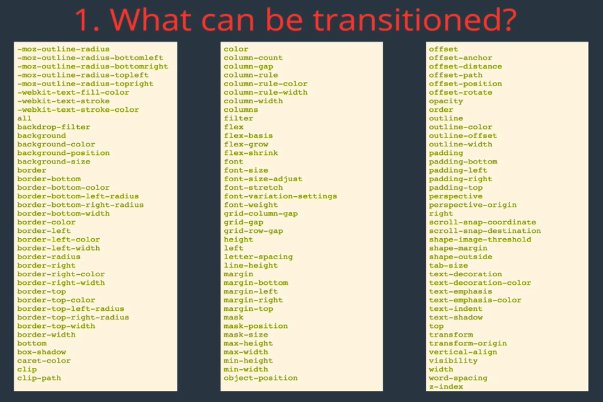

# CSS 3

#### Table of Contents

- [CSS 3](#css-3)
      - [Table of Contents](#table-of-contents)
  - [CSS Animations](#css-animations)
    - [Pseudoclasses](#pseudoclasses)
      - [:hover](#hover)
      - [:focus](#focus)
      - [:active](#active)
    - [Transform](#transform)
      - [Transform: Translate](#transform-translate)
      - [Transform: Scale](#transform-scale)
      - [Transform-Origin](#transform-origin)
      - [Transform: Rotate](#transform-rotate)
      - [Browser (Vendor) Prefixes](#browser-vendor-prefixes)
    - [Transitions](#transitions)
      - [Transition Shorthands](#transition-shorthands)
      - [What Can Be Transitioned](#what-can-be-transitioned)
      - [What Should Be Transitioned](#what-should-be-transitioned)
    - [Keyframes](#keyframes)
    - [CSS Animation Properties](#css-animation-properties)
      - [Animation Shorthand](#animation-shorthand)
  - [Layout With Flexbox](#layout-with-flexbox)
    - [Intro to Flexbox](#intro-to-flexbox)
      - [Display: Flex Property](#display-flex-property)
      - [Flex Terminology](#flex-terminology)
    - [Flexbox Properties of Container](#flexbox-properties-of-container)
      - [Flex-direction](#flex-direction)
      - [Flex-wrap](#flex-wrap)
      - [Justify-content](#justify-content)
      - [Align-items](#align-items)
      - [Align-content](#align-content)
    - [Flexbox Properties of Item](#flexbox-properties-of-item)
      - [Align-self](#align-self)
      - [Order](#order)
      - [Flex](#flex)
      - [Flex-basis](#flex-basis)
      - [Flex-grow](#flex-grow)
      - [Flex-shrink](#flex-shrink)
    - [Holy Grail Layout](#holy-grail-layout)
    - [Flexbox Browser Support](#flexbox-browser-support)
    - [Responsiveness](#responsiveness)

## CSS Animations

### Pseudoclasses

Usually animations are triggered by something, they do not happen on page load

Pseudoclasses are commonly used triggers, special selectors which are added to selector and specify a special state of the selected elements (not only related to animations)
- They let you apply a style to an element not only in relation to the content fo the document tree, but also in relation to external factors, e.g.
  - History of the navigator (:visited)
  - Status of the content (:checked)
  - Position of the mouse (:hover)

Syntax:

```css
selector:pseudo-class {
  property: value;
}
```

#### :hover

Trigger by a user mousing over (not necessarily activating it)

```css
div:hover {
  background: purple;
}
```

#### :focus

Triggers when an element 'receives focus' (triggered when the user clicks, taps on an element or selects with 'tab')

```css
input:focus {
  color: red;
}
```

#### :active

Triggers when an element is 'being activated by user' (click on an element (actual action is happening) or when it's selected by 'tab', commonly used on \<a> or \<button>)

```css
button:active {
  color: green;
}
```

### Transform

It lets you manipulate the coordinate space of the CSS visual formatting model, i.e. lets you move, warp, rotate, and scale elements
- If we put two 'translate' only the latter will work, so we need to use single transform

Syntax:

```css
transform: function(value1, value2, ...);
/* transform: scale(2, 0.5); */
transform: function1(value1) function1(value1, value2, ...);
/* transform: translateX(10px) rotate(10deg) translateY(5px); */

/* global values */
transform: inherit;
```

#### Transform: Translate

Move something around (usually used on trigger)

```css
p.move-right {
  transform: translateX(100px);
  /* negative makes it move left */
}

p.move-down {
  transform: translateY(100px);
  /* negative makes it move up */
}

p:hover {
  transform: translate(20px, 20px);
  /* x and then y */
  /* translate works with original position (as if the paragraph wasn't moved before with examples above) */
}
```

#### Transform: Scale

Alter the size of an elemnent (every aspect of it, like border, font, etc.)

```css
div {
  transform: scale(2);
  /* doubles the size of all divs */
  /* decimals shrink the element (0.5) */
  /* there are also scaleX and scaleY */
  /* scale(2,5) makes it twice as long on X axis, 5 times large on Y axis */
}
```

#### Transform-Origin

Transform takes as an origin the middle of an element, and (for example) scales it evenly from there

We can change it:

```css
transform-origin: 0 0;
/* set origin to left up corner */
/* we can give a direction: */
transform-origin: left;
/* transforms from the left side on X (keeps center for the Y position) */
transform-origin: left bottom;
/* scales up from the left and from the bottom */
```

#### Transform: Rotate

Allows us to rotate elements (positive clock-wise, negative counter clock-wise)

```css
div {
  transform: rotate(45deg);
}
```

#### Browser (Vendor) Prefixes

These are prefixes we need to add to transform in order for it to work across different browsers (as well as some other new, non-standard properties)
- ``-webkit-transform: rotate(90deg)``

The major browsers use the following prefixes:

- -webkit- (Chrome, Safari, newer versions of Opera, almost all iOS browsers (including Firefox for iOS); basically, any WebKit based browser)
- -moz- (Firefox)
- -o- (Old, pre-WebKit, versions of Opera)
- -ms- (Internet Explorer and Microsoft Edge)

We can use this tool to put prefixes for you: https://autoprefixer.github.io or built-in prefixes addition in VSCode

### Transitions

Allow us to control animation when changing CSS properties, e.g. double the size of this div over 3 seconds

4 transition properties:

- transition-duration
  - Controls the timing of a change, how long it should take
- transition-property
  - Calling out which individual CSS properties we want to transition
- transition-timing-function
  - Acceleration of transition (linear or other)
  - See easings.net for examples or matthewlein.com/ceaser
- transition-delay
  - Once a change is set to occur, determine how long we wait until the transition starts

Examples:

```css
/* transition-duration */
transition-duration: 1s;
transition-duration: 3s, 1s;

/* p class="animated box" */

.animated {
  transition-duration: 0.3s;
}

.box:hover {
  transform-origin: top left;
  transform: scale(2);
}

/* transition-property */

transition-property: opacity;

.animated {
  transition-duration: 0.3s;
  transition-property: transform;
  /* you can't choose only scale or only rotate */
  /* transition-property: all; for all properties */
  /* use comma to separate properties if you want to select multiple */
  /* transition-property: background, border-radius; */
  /* transition-duration: 5s, 1s; for background and border-radius respectively */
}

.box:hover {
  background-color: purple;
  transform-origin: top left;
  transform: scale(2) rotate(45deg);
  border-radius: 50px;
}

/* transition-delay */

transition-delay: 3s;
transition-delay: 5ms, 6s; /* the same as with transition-property, they work independently of each other */

/* transition-timing-function */

transition-timing-function: ease-in;
transition-timing-function: ease-out;
transition-timing-function: linear;
transition-timing-function: cubic-bezier(0.950, 0.050, 0.795, 0.035);
```

#### Transition Shorthands

Syntax:

```css
transition: background 1.5s ease-in 1;
/* property duration timing-function delay */
/* for multiple: */
transition: transform 2s ease-out 1s, 
background-color 0.5s linear;
```

#### What Can Be Transitioned



#### What Should Be Transitioned

Mostly we should use properties which perform best and don't affect performance negatively (not a hard rule, just recommended)
- See more: https://www.html5rocks.com/en/tutorials/speed/high-performance-animations/

- transform: translate(npx, npx)
- transform: scale(n)
- transform: rotate(ndeg)
- opacity 0 ... 1

### Keyframes

Unlike transitions, keyframe animations allow us to build more complex, multi-component and multi-state animations while providing more control over them

- Transitions allow us to animate a single state change (from A to B)
- Keyframes allow us to animate multi-state change (from A to B to C to D to E...)
  - Keyframe is actually a point that we set to change state, e.g. at: ``0% color: red; font-size: 20opx, 25% color: orange; 50% color: yellow; font-size: 40px, 75% color: green, 100%: color: blue; font-size: 20px``
  - This example shows how some text gradually grows and shrinks while changing colors

Syntax (rainbow text example):

```css
/* <p> Hello </p> */

/* step 1: define (nothing will happen, we just define it) */
/* as many steps inside of it as we want */

@keyframes rainbowtext {
  0%{
    color: red;
    font-size: 20px;
  }
  25%{
    color: orange;
  }
  50% {
    color: yellow;
    font-size: 40px;
    transform: translateX(200px);
  }
  75%{
    color: green;
  }
  
  85%{
    color: blue
  }
  100% {
    color: purple;
    font-size: 20px;
  }
}

/* step 2 - assignment */

p {
  animation-name: rainbowtext;
  animation-duration: 5s;
  animation-timing-function: linear;
  animation-delay: 0s;
  /* nothing triggers it, start on page load */
  animation-iteration-count: infinite;
  /* how many times this animation runs */
}
```

### CSS Animation Properties

Options to control animation:

Most common (they sort of have analogues to transitions):

- animation-name
- animation-duration
- animation-timing-function
- animation-delay

'Newer' ones:

- animation-iteration-count
  - How many times should animation repeat
- animation-fill-mode
  - Specifies how an animation should apply styles before  (during delay) and after the animation
    - Forwards (takes the end state and it makes it linger, stay)
    - Backwards (takes 0% value and applies it immediately, if there is a delay, it stays at the initial animation state during it)
    - Both
    - None
- animation-direction
  - When we have an animation defined, we can run it forward, in reverse, or alternate it (make it run back and forth)
- animation-play-state
  - Specifies whether the animation is running or paused
    - Usually this is used with JS, but can be something like ``box:hover {animation-play-state: paused;}``

#### Animation Shorthand

Order is important within each animation definition (e.g. first time is duration, second time is delay); long statements make the code hard to read
- For some properties, order doesn't matter: we can put different things first

```css
animation: 3s ease-in 1s 2 reverse both paused slidein;
animation: changecolor 3s linear 1s infinite;
animation: jiggle 4s;
```

---

## Layout With Flexbox

### Intro to Flexbox

Flexbox is a layout model, it is a more efficient way to lay out, align and distibute space among items in a container (even if their size is unknown)
- See https://css-tricks.com/snippets/css/a-guide-to-flexbox/

Container properties:
- flex-direction
- justify-content
- flex-wrap
- align-items
- align-content

Flex item properties:
- order
- flex
- flex-grow
- flex-shrink
- align-self

#### Display: Flex Property

```css
.container {
  display: flex;
  /* sets container to flex */
}
```

#### Flex Terminology

Inside of a flex container there are two axes: main axis (x, by default goes from left to right) and cross axis (y, by default goes from top to bottom); all items are aligned along them (they are called flex items)

### Flexbox Properties of Container

#### Flex-direction

Specifies how items are placed in the flex container, defining the main axis and its direction

```css
flex-direction: row; /* default value for main axis */
flex-direction: row-reverse; /* main axis goes from right to left, changes order of items */
flex-direction: column; /* main axis is now from top to bottom, they basically switch places with cross axis */
flex-direction: column-reverse; /* main axis is now from bottom to top */
```

#### Flex-wrap

Specifies whether items are forced into a single line (default) or can be wrapped into multiple lines

```css
flex-wrap: wrap; /* items can be placed into multiple lines, it'll automatically make additional rows if needed */
flex-wrap: no-wrap; /* default */
flex-wrap: wrap-reverse; /* applies wrap and reverses the start/end of the cross axis (it's now from bottom to top */
```

#### Justify-content

Defines how space is distributed between items in flex container along the main axis

```css
justify-content: flex-start; /* default */
justify-content: flex-end; /* content moves to the right side without changing order*/
justify-content: center; /* centers content */
justify-content: space-between; /* divides space between elements, putting them to edges */
justify-content: space-around /* evenly divides space around items */
```

#### Align-items

Defines how space is distributed between items in flex container along the cross axis

```css
align-items: flex-start; /* content moves to the top, sticks to it, takes minimum amount of space we need */
align-items: flex-end; /* content moves to the bottom side */
align-items: stretch; /* default, takes up the whole container */
align-items: center; /* centers content along the cross axis */
align-items: baseline; /* align items based on the baseline of the text font (as in copybook) */
```

#### Align-content

Defines how space is distributed between rows in flex container along the cross axis (if there are multiple rows)

```css
align-content: stretch; /* default, takes up the whole space */
align-content: flex-start; /* sticks to top */
align-content: flex-end; /* sticks to bottom */
align-content: space-between; /* divides space between rows, sticking them to edges */
align-content: space-around; /* evenly divides space around rows */
align-content: center; /* centers rows */
```

### Flexbox Properties of Item

#### Align-self

Allows us to override align-items on individual flex items

```css
.container {
  align-items: flex-start;
  /* makes all items stick to the top */
}

.item-2, .item-3 {
  align-self: flex-end;
  /* sets second and third items to stick to bottom */
}
```

#### Order

Specifies the order used to lay out items in their flex container
- By default everything has an order of 0, i.e. doesn't matter what the numbers are, the only thing that matters is relation between 'order' values in items
- Using negative numbers makes an item go to the first place

```css
.item-1 {
  order: 2;
  /* 4 items, item 1 goes to the last place */
}

/* |2| |1| |3| |4| : making item 1 second in line */

.item-1 {
  order: 2;
}

.item-2 {
  order: 1;
}

.item-3, .item-4 {
  order: 3;
}
```

#### Flex

Defines how a flex item will frow or shrink to fit the available space in a container; it's a shorthand which allows us to control flex-grow, flex-shrink, flex-basis

```css
.container {
  flex: 2 1 200px;
  /* grow shrink basis */
}
```

#### Flex-basis

Specifies the ideal, initial size of a flex item before it's placed into a flex containers (sort of like width, but not; it's like height when working with columns)
- Between weight/height and flex-basis, flex-basis wins
- See difference: http://gedd.ski/post/the-difference-between-width-and-flex-basis/

```css
flex-basis: 200px;
```

#### Flex-grow

Dictates how the unused space should be spread amongst flex items (it's all about ratios)

```css
.box {
  flex-grow: 1;
  /* boxes share space evenly, the number could be anything as long as all items share the same number */
}

.box-2 {
  flex-grow: 2;
  /* equals to 9-18, 10-20, 100-200, the ratio is important */
  /* it will take that unused space and get two times as much compared to the others */
  /* this does not mean making the box twice as large, it means use twice as much available space */
}

/* imagine container has 1000px width */

.box-1, .box-2 {
  width: 100px;
  /* 800px of free space */
}

.box-1, .box-2 {
  width: 100px;
  flex-grow: 1;
  /* each 500px */
}

.box-1, .box-2 {
  width: 100px;
}

.box-1 {
  flex-grow: 1;
  /* 260px */
}

.box-2 {
  flex-grow: 4;
  /* 740px; not 4 times as large */
  /* 5 parts of unused space, each 160px; 1 goes to box 1, 4 to box 2 */
}
```

#### Flex-shrink

Dictates how items should shrink when there isn't enough space in container (math is different from flex-grow, a complicated one; but it's roughly proportional, ratio matters)

```css
flex-shrink: 1; /* default */
flex-shrink: 0; /* never shrink */
flex-shrink: 2; /* shrinks fater than other items */
/* common scenario */

```


### Holy Grail Layout

The holy grail refers to a web page layout which has multiple, equal height columns that are defined with style sheets; it is commonly desired and implemented, but for many years, the various ways in which it could be implemented with the current technologies all had drawbacks

Because of this, finding an optimal implementation was likened to searching for the elusive Holy Grail

The CSS3 standards contain modules which are intended for layout of page elements; two of these fully solve the holy grail problem (flexbox and grid layout)

### Flexbox Browser Support

For a long time flexbox wasn't used because it wasn't supported, but now it's good for most of the modern browsers without any prefixes
- Check caniuse.com if in doubt
- https://medium.com/css-mine/flexbox-how-to-deal-with-older-browsers-fbf6eb8c7a65

---

### Responsiveness

We can set different styles for different screen sizes using @media query

```css
/* technically we can omit 'screen and' */

@media screen and (max-width: 920px) {
  nav {
    justify-content: center;
  }
  a {
    font-size: 26px;
  }
}

@media screen and (max-width: 600px) {
  nav {
    flex-direction: column;
    align-items: center;
    background: #34495e;
  }
  a {
    color: white;
  }
}
```