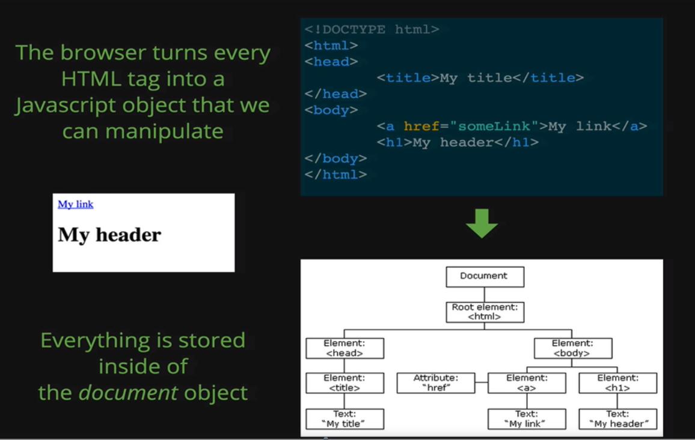

# JS and HTML

#### Table of Contents

- [JS and HTML](#js-and-html)
      - [Table of Contents](#table-of-contents)
  - [DOM](#dom)
    - [DOM (Document Object Model)](#dom-document-object-model)
    - [The Process of DOM Manipulation](#the-process-of-dom-manipulation)
  - [DOM Selectors](#dom-selectors)
    - [getElementById](#getelementbyid)
    - [getElementsByClassName](#getelementsbyclassname)
    - [getElementsByTagName](#getelementsbytagname)
    - [querySelector](#queryselector)
    - [querySelectorAll](#queryselectorall)
  - [DOM Manipulation](#dom-manipulation)
    - [Changing an element's style](#changing-an-elements-style)
      - [Separation of Concerns](#separation-of-concerns)
    - [Adding/removing classes](#addingremoving-classes)
    - [Retreiving and changing the content of a tag](#retreiving-and-changing-the-content-of-a-tag)
      - [textContent](#textcontent)
      - [innerHTML](#innerhtml)
    - [Changing attributes (src, href, etc.)](#changing-attributes-src-href-etc)
  - [Events](#events)
      - [Mouseover and mouseout example](#mouseover-and-mouseout-example)
  - [jQuery](#jquery)
    - [jQuery Selectors](#jquery-selectors)
    - [Manipulating Style](#manipulating-style)
    - [Common jQuery Methods](#common-jquery-methods)
      - [val()](#val)
      - [text()](#text)
      - [attr()](#attr)
      - [html()](#html)
      - [addClass()](#addclass)
      - [removeClass()](#removeclass)
      - [toggleClass()](#toggleclass)
      - [append()](#append)
      - [parent()](#parent)
    - [jQuery Events](#jquery-events)
      - [click()](#click)
      - [keypress()](#keypress)
      - [on()](#on)
      - [click() and on('click')](#click-and-onclick)
    - [Event bubbling](#event-bubbling)
    - [jQuery Effects](#jquery-effects)
      - [Fading](#fading)
      - [Sliding](#sliding)

## DOM

### DOM (Document Object Model)

Note: the script should be located at the bottom of an HTML doc right before the \</body>

DOM stands for 'Document Object Model'\
It is the interface between your Javascript and HTML+CSS

Number of special JS methods, objects, functions that we can use to interact with HTML and CSS: change, move, add, etc.

The browser turns every HTML tag in a JS object, each object models one of the elements, and everything is stored inside of the *document* object



### The Process of DOM Manipulation

SELECT an element and then MANIPULATE it

```javascript
var h1 = document.querySelector('h1'); // select

h1.style.color = 'pink'; // manipulate

var body = document.querySelector('body'); // select
var isBlue = false;

setInterval(function () { // manipulate
    if (isBlue) {
        body.style.background = 'white';
    } else {
        body.style.background = '#3498db';
    }
    isBlue = !isBlue;
}, 1000); // changes background color from white to blue every second
```

---

## DOM Selectors

5 main methods for selecting elements:
- ``document.getElementById()``
- ``document.getElementsByClassName()``
- ``document.getElementsByTagName()``
- ``document.querySelector()``
- ``document.querySelectorAll()``

### getElementById

Takes a string argument and returns the one element with a matching ID (as an object)

```javascript
var tag = document.getElementById('highlight');
```

```html
<body>
    <h1>Hello</h1>
    <h1>Goodbye</h1>
    <ul>
        <li id='highlight'>List item 1</li> <!-- selected -->
        <li class='bolded'>List item 2</li>
        <li class='bolded'>List item 3</li>
    </ul>
</body>
```

### getElementsByClassName

Takes a string argument and returns a list of elements that have a matching class as an 'HTMLCollection'

HTMLCollection is a collection of DOM nodes which only contains Element nodes (in contrast with 'NodeList' which can contain any node type)
- It is somewhat similar to an array but more 'lightweight', i.e. we can access items in it by index, but can't use forEach and many other things
- Every item in this collection is an object

```javascript
var tags = document.getElementsByClassName('bolded');

console.log(tags[0]); // first <li> with class 'bolded' (List item 2)
```

```html
<body>
    <h1>Hello</h1>
    <h1>Goodbye</h1>
    <ul>
        <li id='highlight'>List item 1</li>
        <li class='bolded'>List item 2</li> <!-- selected -->
        <li class='bolded'>List item 3</li> <!-- selected -->
    </ul>
</body>
```

### getElementsByTagName

Returns a list of all elements of a given tag name, like \<li> or \<h1> (even if there is only one of a type, like \<body>\
Every item is an object

```javascript
var tags = document.getElementsByTagName('li');

console.log(tags[0]); // first <li> (List item 1)
```

```html
<body>
    <h1>Hello</h1>
    <h1>Goodbye</h1>
    <ul>
        <li id='highlight'>List item 1</li> <!-- selected -->
        <li class='bolded'>List item 2</li> <!-- selected -->
        <li class='bolded'>List item 3</li> <!-- selected -->
    </ul>
</body>
```

### querySelector

Returns the first element that matches a given CSS-style selector (any selector we would use in a CSS document) as an object

```javascript
// select by ID
var tagById = document.querySelector('#highlight'); // CSS syntax inside

// select by class
var tagByClass = document.querySelector('.bolded');

// select by tag
var tag = document.querySelector('h1');

var absentTag = document.querySelector('li a.special'); // returns null
```

```html
<body>
    <h1>Hello</h1> <!-- selected by tag (tag) -->
    <h1>Goodbye</h1>
    <ul>
        <li id='highlight'>List item 1</li> <!-- selected by ID (tagById) -->
        <li class='bolded'>List item 2</li> <!-- selected by class (tagByClass) -->
        <li class='bolded'>List item 3</li>
    </ul>
</body>
```

### querySelectorAll

Returns a list of elements that match a given CSS-style selector (even if there is only one of a type)\
Every item is an object

```javascript
// select by tag
var tags = document.querySelectorAll('h1');

// select by class
var tagsByClass = document.querySelectorAll('.bolded');
```

```html
<body>
    <h1>Hello</h1> <!-- selected by tags -->
    <h1>Goodbye</h1> <!-- selected by tags -->
    <ul>
        <li id='highlight'>List item 1</li>
        <li class='bolded'>List item 2</li> <!-- selected by class (tagsByClass) -->
        <li class='bolded'>List item 3</li> <!-- selected by class (tagsByClass) -->
    </ul>
</body>
```

---

## DOM Manipulation

### Changing an element's style

The style property is one way to manipulate an element's style

```javascript
// select
var tag = document.getElementById('highlight');

// manipulate (note: follow JS rules since it is JS, and not CSS)
tag.style.color = 'blue';
tag.style/border = '5px solid red';
tag.style.fontSize = '24px';
tag.style.background = 'yellow';
tag.style.marginTop = '200px';
```

It is not recommended to follow this example (in general)

It is recommended for styles to be defined in a separate file or files; the style property allows for quick styling, e.g. for testing purposes

#### Separation of Concerns

Separation of Concerns is a concept that HTML, JS, and CSS are each responsible for their own domain (structure, behavior, presentation)

### Adding/removing classes

Rather than directly manipulate style with JS, we can define a CSS class and then toggle it on or off with JS

```CSS
.some-class {
    color: blue;
    border: 3px solid red;
}
```

```javascript
var tag = document.getElementById('highlight');
// add the new class to the selected element
tag.classList.add('some-class');
```

classList is a read-only list that contains the classes for a given element
- It is not an array!

```javascript
var tag = document.querySelector('h1');

// add a class the the selected element
tag.classList.add('another-class');

// remove a class
tag.classList.remove('another-class');

// toggle a class
tag.classList.toggle('another-class');
```

### Retreiving and changing the content of a tag

#### textContent

Returns a string of all the text contained in a given element

```html
<p>This is an <strong>awesome</strong> paragraph</p>

<ul>
    <li>Orchid</li>
    <li>Succulents</li>
    <li>Tulips</li>
<ul>
```

```javascript
// select the tag
var tag = document.querySelector('p');
var ul = document.querySelector('ul');

// retrieve the textContent
tag.textContent // 'This is an awesome paragraph' (doesn't contain the tags, just everything inside of a selected tag)
ul.textContent // ' Orchids Succulents Tulips '

// alter the textContent (kind of dangerous since there won't be any tags inside of an element, like <strong>)
tag.textContent = 'blah blah blah';
```

#### innerHTML

Similar to textContent, except it returns a string of all the HTML contained in a given element
- Rarely used to alter the content

```html
<p>This is an <strong>awesome</strong> paragraph</p>

<ul>
    <li>Orchid</li>
    <li>Succulents</li>
    <li>Tulips</li>
<ul>
```

```javascript
// select the tag
var tag = document.querySelector('p');
var ul = document.querySelector('ul');

tag.innerHTML // 'This is an <strong>awesome</strong> paragraph'
ul.innerHTML // ' <li>Orchids</li> <li>Succulents</li> <li>Tulips</li> '

document.body.innerHTML // returns all of the body's HTML; when changed will treat tags as HTML tags
document.body.textContent // returns only the text present on the page; when changed will treat tags as plain text
```

### Changing attributes (src, href, etc.)

Use getAttribute() and setAttribute() to read and write attributes like src or href

```html
<a href="http://www.google.com">I am a link</a>

```

```javascript
var link = document.querySelector('a');
link.getAttribute('href'); // 'http://www.google.com'
link.setAttribute('href', 'http://www.dogs.com'); // <a href="http://www.dogs.com">I am a link</a>

var img = document.querySelector('img');
img.setAttribute('src', 'corgi.png'); // 
```

---

## Events

We select an element and then add an event listener
- 'Listen for a click on this \<button>'
- 'Listen for a hover event on the \<h1>'
- 'Listen for a keypress event on text input'

Syntax:\
To add a listener, we use a method called addEventListener

```javascript
element.addEventListener(type, functionToCall);

var button = document.querySelector('button'); // function can also be named, e.g. changeText (no parenthesis)
button.addEventListener('click', function() {
    console.log('Someone clicked the button!');
});

// this is a callback, i.e. this function is called only when the event happens, JS 'comes back' in the code and 'tells' the function to 'fire'

// there could be more than one event listener

// we can use an arrow function ('click', () => {}) but be careful since it doesn't have its own 'this' context
```

#### Mouseover and mouseout example

```html
<ul>
    <li>Item 1</li>
    <li>Item 2</li>
    <li>Item 3</li>
</ul>
```

```javascript
var lis = document.querySelectorAll('li');

// code which changes the color when mouse is over an element
for (var i = 0; i < lis.length; i++) {
    lis[i].addEventListener('mouseover', function() { // it doesn't fire constantly, only once when the mouse is over the element
        this.style.color = 'green';
    });
    lis[i].addEventListener('mouseout', function() {
        this.style.color = 'black';
    });
}
```

---

## jQuery

jQuery is a DOM manipulation library
- Library is some code that's been written, and we can use this code in our project (e.g. methods)
- When adding libraries it's a good practice to put them into a separate 'lib' folder

jQuery helps
- Select elements
- Manipulate elements
- Create elements
- Add event listeners
- Animate elements
- Add effects
- Make HTTP requests (AJAX)

Reasons to use jQuery:
- Fixes 'broken' DOM API
    - The DOM API was considered 'broken' for a while
- Brevity and Clarity
- Ease of use
- Cross-browser Support
- AJAX
- Many people use it
    - There is a strong community which can help

Reasons to not use jQuery:
- The DOM API is no longer 'broken'
- It doesn't do anything you can't do on your own
    - youmightnotneedjquery.com
- It's an unnecessary dependency
    - You don't exactly need everything in jQuery
- Performance
    - You can write inefficient and slower code (sometimes)
- Lots of people are moving away from jQuery

Either way, it's worth knowing

### jQuery Selectors

Selection with jQuery is very similar to querySelectorAll, in that we provide a CSS style selector and jQuery will return all matching elements
- ``$('selectorGoesHere')``

```javascript
// to select all img tags
$('img');

// to select all elements with class 'sale'
$('.sale');

// to select element with id 'bonus'
$('#bonus');

// to select all 'a' tags inside of 'li's
$('li a');
```

### Manipulating Style

The .css() method is jQuery's interface to styling
- ``$(selector).css(property, value)``

```javascript
// gives an element with id 'special' a red border
$('#special').css('border', '2px solid red');

// we can also pass in an object with styles
var styles = {
    backgroundColor: 'pink',
    fontWeight: 'bold'
}

$('#special').css(styles);

// we can style multiple elements at once (doesn't require a loop or something else)

// select all li's and make them yellow
$('li').css('color', 'yellow');

// select all elements with class 'big' and give them an orange border
$('.big').css('border', '1px dashed orange');
```

### Common jQuery Methods

Many of them follow the 'Getter and Setter' paradigm (we can use them both for retreiving and setting information)

```html
<style type="text/css">
    .correct {
        color: green;
    }

    .wrong {
        color: red;
        background: pink;
    }

    .done {
        color: gray;
        text-decoration: line-through;
    }
</style>

<h1>jQuery Methods Demo Page</h1>

<input type="text" placeholder="Your name">

<select>
    <option>Cat</option>
    <option>Dog</option>
    <option>Other</option>
</select>

<ul>
    <li>Skittles</li>
    <li>Starburst</li>
    <li>Twix</li>
</ul>


```

#### val()

Get the current vlue of the first element in the set of matched elements or set the value of every matched element
- Similar to .value()
- Works with checkboxed, dropdown menus, etc.

```javascript
$('input').val(); // '' (since it's empty)
$('input').val('Something is here'); // 'Something is here' inside of an input; it is used sometimes to delete the value with an empty string
$('select').val(); // returns what's selected, e.g. 'Dog'
```

#### text()

Gets the combined text contents of each elements in a set of matched elements (including descendants) or set the text content
- Similar to textContent

```javascript
$('h1').text(); // 'jQuery Methods Demo Page'
$('ul').text(); // ' Skittles Starburst Twix '
$('li').text(); // 'SkittlesStarburstTwix'
$('h1').text('New text!'); // <h1>New text!</h1>
$('li').text('I am a new li'); 
// I am a new li
// I am a new li
// I am a new li
```

#### attr()

Get the value of an attribute for the first element in the set of matched elements or set one or more attributes for every matched element

```javascript
$('img').attr('src'); // 'www.google.com/img.jpg'
$('img').attr('src', 'www.yandex.ru/img.jpg'); // 
$('input').attr('type', 'checkbox'); // changes input into a checkbox
$('img:first-of-type') // to choose the first element we can also use ':first' or .first(), but it's a jQuery thing so it's a little slower
$('img').last().attr('src', 'www.rambler.ru/img.jpg'); // changing the last element's attribute
```

#### html()

Get the HTML contents of the first element in the set of matched element or set the HTML content if every matched element
- Similar to innerHTML

```javascript
$('ul').html(); // ' <li>Skittles</li> <li>Starburst</li> <li>Twix</li> '
$('ul').html('<li>I hacked your UL</li><li>Yes I did</li>')
// <li>I hacked your UL</li>
// <li>Yes I did</li>
$('li').html('<a href="google.com">Click me to go to Google</a>');
// <li><a href="google.com">Click me to go to Google</a></li>
// <li><a href="google.com">Click me to go to Google</a></li>
```

#### addClass()

Adds the specified class(es) to each element in the set of matched elements
- Similar to classList.add()

```javascript
$('h1').addClass('correct'); // <h1 class="correct">jQuery Methods Demo Page</h1>
```

#### removeClass()

Removes the specified class(es) from each element in the set of matched elements
- Similar to classList.remove()

```javascript
$('h1').removeClass('correct'); // <h1 class="">jQuery Methods Demo Page</h1>
```

#### toggleClass()

Toggles the specified class(es) in each element in the set of matched elements
- Similar to classList.toggle()

```javascript
$('h1').toggleClass('correct'); // <h1 class="correct">jQuery Methods Demo Page</h1>
$('h1').toggleClass('correct'); // <h1 class="">jQuery Methods Demo Page</h1>

// works for every element individually
$('li').first().toggleClass('done');
// <li class="done">Skittles</li>
// <li class="">Starburst</li>
// <li class="">Twix</li>
$('li').toggleClass('done');
// <li class="">Skittles</li>
// <li class="done">Starburst</li>
// <li class="done">Twix</li>
```

#### append()

We select an element to append to and then add something to this element as an HTML

```javascript
$('ul').append('<li>This is a new li</li>');
```

#### parent()

Lets you access the parent element, gives us the parent element as a jQuery element

```javascript
// <li><span>Something</span> Else</li>
$('span').click(function() {
    $(this).remove(); // will remove only the span ('Something')
    $(this).parent().remove(); // will remove the whole li ('Something Else')
});
```

### jQuery Events

There are many different event methods in jQuery

Three main methods:
- click()
- keypress()
- on()

#### click()

It is a quick and easy way to add a click listener to element(s)

```javascript
// prints when item with id 'submit' is selected
$('#submit').click(function() {
    console.log('Another click');
});

// alerts when any button is clicked
$('button').click(function() {
    alert('Someone clicked a button');
});

// we need to use jQuery $(this) if we want to refer to the element which was clicked (and not all elements)
$('button').click(function() {
    $(this).css('background', 'pink');
});
```

#### keypress()

It is a simple way to add a keypress listener to element(s)
- keydown() fires when someone presses the button on a keyboard
- keyup() fires when someone releases the button on a keyboard
- keypress() fires in between down and up (usually)
    - keydown and keyup provide a code indicating which key is pressed, while keypress indicates which character was entered
    - e.g. if a user inputs an uppercase A, keydown and key up will fire on shift key and on the lowercase a, while keypress will fire on uppercase A (it cares about end result character)

```javascript
$('input[type="text"]').keypress(function() {
    console.log('You pressed a key');
});

$('input[type="text"]').keypress(function(event) { // event is an object which contains all the information about the keypress event (time, type, charCode, which etc.)
    if (event.which === 13) { // which contains a char code (charCode does as well but there are some differences)
        console.log('You pressed enter');
    }
});
```

#### on()

Work similarly to addEventListener; it lets you specify the type of event to listen for

```javascript
// prints when item with id 'submit' is selected
$('#submit').on('click', function() {
    console.log('Another click');
});

// alerts when any button is clicked
$('button').on('click',function() {
    alert('Someone clicked a button');
});

// double click event
$('button').on('dblclick', function() {
    alert('Double clicked!');
});

// drag start event
$('a').on('dragstart', function() {
    console.log('Drag started');
});

// keypress event
$('input[type="text"]').on('keypress', function() {
    alert('Key press in an input!');
});

// create a hover selection event which makes a button text bold
// mouse enter event
$('button').on('mouseenter', function() {
    $(this).css('font-weight', 'bold');
});
// mouse leave event
$('button').on('mouseleave', function() {
    $(this).css('font-weight', 'normal');
});
```

#### click() and on('click')

There is a key difference between these methods
- click() only adds listeners for existing elements
- on('click') will add listeners for all potential future elements

```javascript
// we can only add listeners to elements which existed when this code is run the first time
// we add a listener to the ul parent, and the listener will technically fire every time the ul is clicked
// adding an argument 'li' specifies that the code should run only when an li inside of ul is clicked
$('ul').on('click', 'li', function () {
    $(this).toggleClass('completed');
});
```

### Event bubbling

Imagine we have a span inside of an li inside of a ul inside of a div

Event bubbling is when event (e.g. click) is triggered for span it then bubbles up to the li and trigger an li click event, and then to ul, to div, etc. until it hits the html element

To prevent it we can tell the event inside of the span to not bubble anymore and not trigger event in any of the parent elements

```javascript
$('span').click(function(event) { // the most common names are e or event
    console.log('You clicked a span');
    event.stopPropagation; // this stops the bubbling
});
```

### jQuery Effects

There are many differents effects in jQuery\
The most common are fading and sliding

#### Fading

- .fadeOut() fades an element out by changing its opacity from 100 to 0 and then sets its 'display' to 'none
- .fadeIn() fades an element in by changing its opacity from 0 to 100 and sets its 'display' to 'block'
- .fadeToggle() toggles the fading (in or out)

```javascript
// all the divs are disappearing in 1 sec when a button is pressed
$('button').on('click', function() {
    $('div').fadeOut(1000, function() {
        console.log('Fade completed'); // this message will be printed after the div disappears
        $(this).remove(); // removes the div from the page
    });
    console.log('Fade completed'); // JS will print this message immediately, it won't wait for the divs to fade out
});
```

#### Sliding

- .slideDown() displays the elements with a sliding motion (animating height)
- .slideUp() hides the elements with a sliding motion
- .slideToggle() displays or hides the elements with a sliding motion